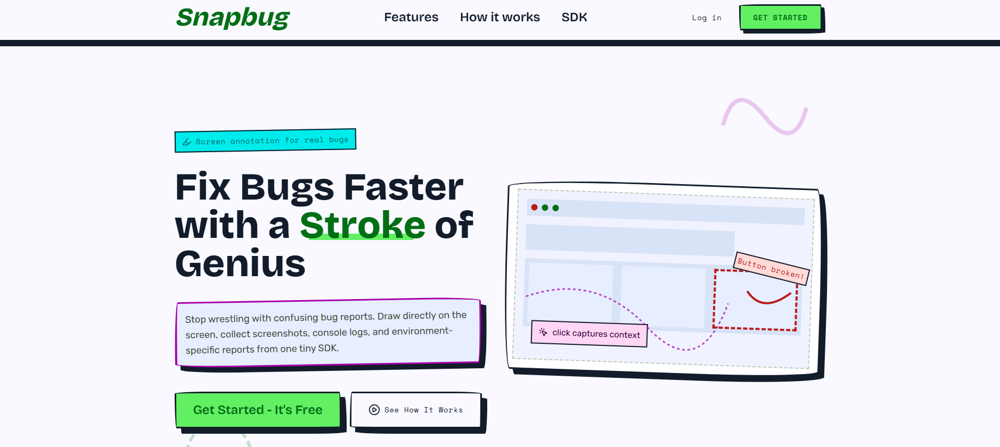
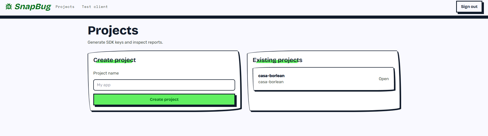
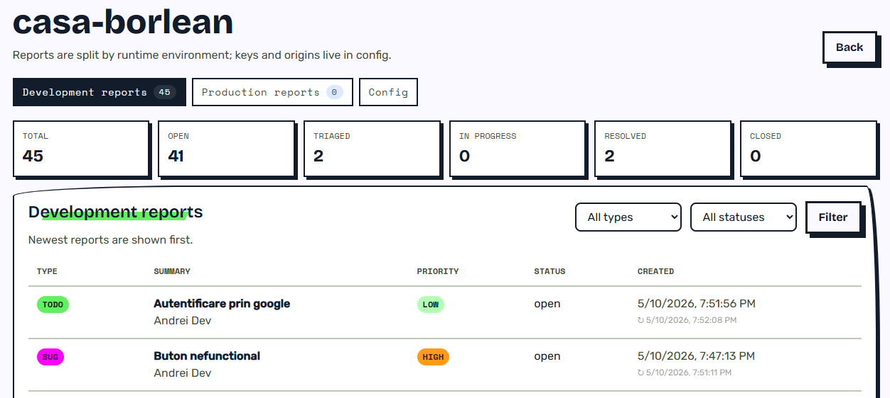
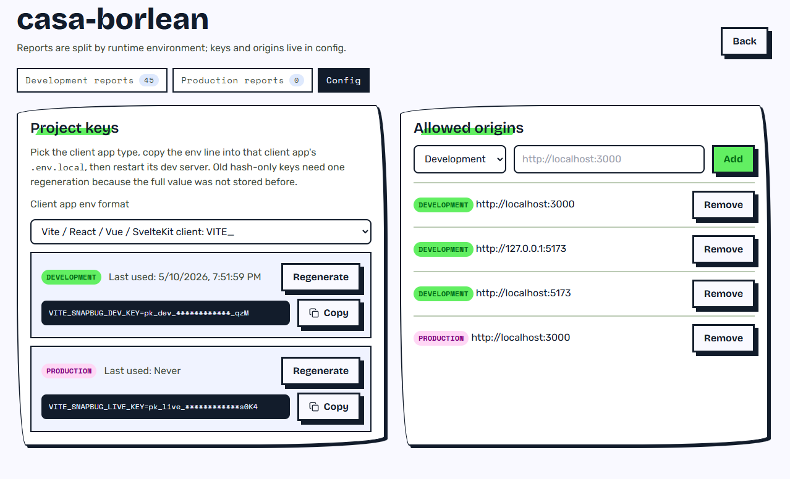
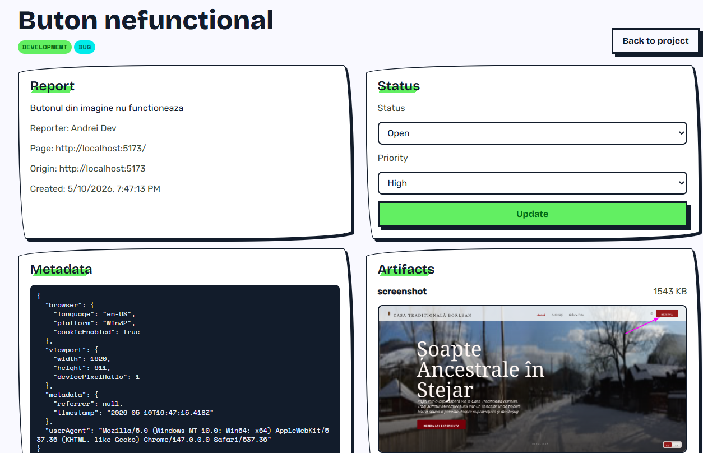
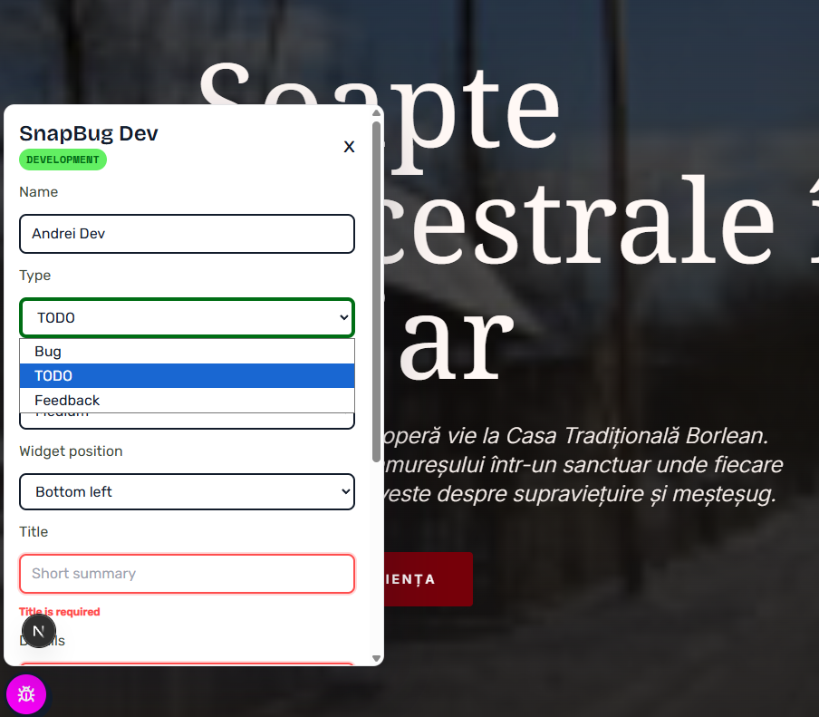
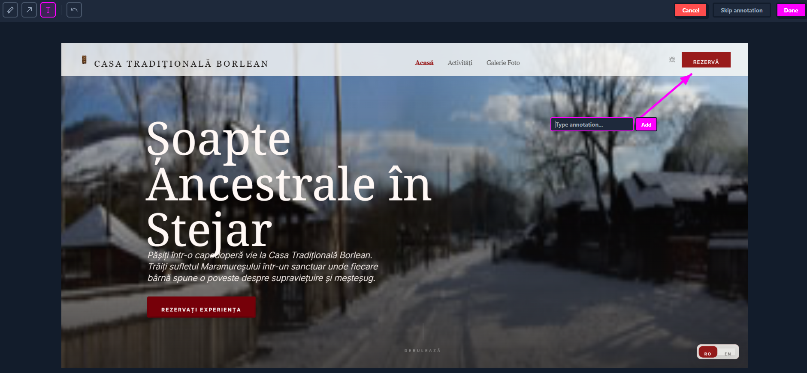

<a id="top"></a>

# SnapBug

SnapBug is a dual-mode bug reporting platform with screenshot capture, dev-only annotation, console log capture, and environment-isolated project management. Teams install a browser SDK in their app, collect visual reports, and manage them from a Supabase-backed dashboard.

## Contents

- [What It Does](#what-it-does)
- [Screenshots](#screenshots)
- [Architecture](#architecture)
- [Local Setup](#local-setup)
- [SDK Integration](#sdk-integration)
- [Report Capture Details](#report-capture-details)
- [Security](#security)
- [Project Structure](#project-structure)
- [Environment Variable Reference](#environment-variable-reference)
- [Scripts](#scripts)
- [Design System](#design-system)
- [Current Limitations](#current-limitations)
- [License](#license)

## What It Does

**Development mode**
- Shows a floating SnapBug icon in local/dev apps.
- Lets developers file bugs, TODOs, or feedback.
- Captures screenshots, page URL, viewport, browser info, recent console logs, and optional rrweb replay events.
- Opens a dev-only annotation overlay after screenshot capture with draw, arrow, text, undo, skip, and cancel controls.
- Lets the widget position be changed between the four screen corners.

**Production mode**
- Does not inject a visible widget. Production always stays app-controlled.
- Your app opens SnapBug with `SnapBug.open()` from any button, menu item, or shortcut you choose.
- Reports are stored as production bugs.
- Users fill in a title and issue description; screenshots and browser context are captured silently.

**Dashboard**
- Public landing page at `/`.
- Authenticated project dashboard at `/projects`.
- Project detail pages split reports into `Development reports`, `Production reports`, and `Config`.
- Filters reports by type and status, newest first.
- Updates report status and priority.
- Shows screenshots in a lightbox and JSON artifacts through signed Supabase Storage URLs.
- Manages project keys and allowed origins per environment.

<p align="right"><a href="#top">Back to top</a></p>

## Screenshots

### Landing Page



### Dashboard







### Report Detail



### SDK Widget





<p align="right"><a href="#top">Back to top</a></p>

## Architecture

```text
snapbug/
|-- apps/web/          Next.js dashboard, widget iframe, auth, and ingest API
|-- packages/sdk/      Browser SDK and screenshot annotator
|-- packages/shared/   Shared TypeScript types and Zod schemas
`-- supabase/          SQL migrations
```

**Stack**
- Frontend: Next.js 16, React 19, Tailwind CSS 3, server components plus focused client components where interaction is needed.
- Backend: Next.js route handlers and server actions.
- Data: Supabase Auth, Postgres, RLS, and private Storage.
- SDK: TypeScript, html2canvas for screenshots, optional `@rrweb/record` for replay.
- Monorepo: pnpm workspaces.

**Data Flow**

1. SDK captures screenshot and browser context in the customer app.
2. Widget iframe posts submit data to the SDK parent window.
3. SDK sends a JSON payload to `/api/ingest`.
4. API validates the payload with Zod, applies rate limiting, verifies the project key, and checks the request origin.
5. Report metadata is inserted in Postgres.
6. Screenshot, console logs, and replay artifacts are uploaded to the private `report-artifacts` bucket.
7. Dashboard reads reports through RLS-protected queries and loads artifacts through signed URLs.

<p align="right"><a href="#top">Back to top</a></p>

## Local Setup

### Prerequisites

- Node.js 18+
- pnpm 10+ through Corepack
- A Supabase project
- Supabase CLI, if you want to apply migrations from the terminal

```bash
corepack enable
corepack prepare pnpm@10 --activate
```

### 1. Install Dependencies

```bash
pnpm install
```

### 2. Configure Environment

The committed example file is at the repository root. Copy it into the Next.js app:

```bash
cp .env.example apps/web/.env.local
```

On PowerShell:

```powershell
Copy-Item .env.example apps/web/.env.local
```

Fill these values:

| Variable | Description |
| --- | --- |
| `NEXT_PUBLIC_SUPABASE_URL` | Supabase project URL. |
| `NEXT_PUBLIC_SUPABASE_PUBLISHABLE_KEY` | Supabase publishable/anon browser key. |
| `SUPABASE_SERVICE_ROLE_KEY` | Supabase service role key. Server-only. Never expose it in browser code. |
| `NEXT_PUBLIC_SNAPBUG_API_BASE_URL` | SnapBug web app URL. Use `http://localhost:3000` locally. |
| `NEXT_PUBLIC_SNAPBUG_DEV_KEY` | Optional for `/test-client`; generated after creating a project. |
| `NEXT_PUBLIC_SNAPBUG_LIVE_KEY` | Optional for `/test-client`; generated after creating a project. |

The SnapBug keys are only needed by the built-in `/test-client`. A separate customer app should use its own framework-specific public env variables.

### 3. Apply Supabase Migrations

This repo stores SQL migrations in `supabase/migrations`. There is no committed `supabase/config.toml`, so link or target your Supabase project before pushing.

One common CLI flow:

```bash
supabase link --project-ref your-project-ref
supabase db push
```

The migrations create:
- Tables: `profiles`, `projects`, `project_keys`, `project_origins`, `reports`, `report_artifacts`.
- Views: `development_reports`, `production_reports`, `bug_reports`, `todo_reports`, `feedback_reports`.
- Private Storage bucket: `report-artifacts`.
- RLS policies for authenticated project owners.
- Grants needed by authenticated users and the service role.

### 4. Start the App

```bash
pnpm dev
```

The web app runs at `http://localhost:3000`.

### 5. Create a Project

1. Open `http://localhost:3000/signup` or use the landing page CTA.
2. Create an account or log in.
3. Go to `/projects`.
4. Create a project.
5. Open the project and go to `Config`.
6. Copy dev/live keys in the format needed by your client app.

You only need to restart a dev server after changing `.env.local` or another env file. Creating a project in the dashboard does not require a restart by itself. The built-in `/test-client` reads `NEXT_PUBLIC_SNAPBUG_DEV_KEY` and `NEXT_PUBLIC_SNAPBUG_LIVE_KEY` from `apps/web/.env.local`, so restart `pnpm dev` after adding or changing those values.

### 6. Test the SDK

After adding test keys and restarting the web dev server, open:

```text
http://localhost:3000/test-client
```

Development mode shows the floating widget and also includes a custom `Report a problem` button. Production mode hides the widget and only opens from the custom button.

<p align="right"><a href="#top">Back to top</a></p>

## SDK Integration

The package is currently private and not published to npm. Inside this monorepo, apps consume it as a workspace package. For distribution builds:

```bash
pnpm sdk:build
```

Basic Vite-style usage:

```ts
import { SnapBug } from "@snapbug/sdk";

SnapBug.init({
  developmentKey: import.meta.env.VITE_SNAPBUG_DEV_KEY,
  productionKey: import.meta.env.VITE_SNAPBUG_LIVE_KEY,
  apiBaseUrl: "https://your-snapbug-app.example.com"
});
```

Next.js browser usage:

```ts
SnapBug.init({
  developmentKey: process.env.NEXT_PUBLIC_SNAPBUG_DEV_KEY,
  productionKey: process.env.NEXT_PUBLIC_SNAPBUG_LIVE_KEY,
  apiBaseUrl: process.env.NEXT_PUBLIC_SNAPBUG_API_BASE_URL
});
```

If the SDK is running on a different origin from the SnapBug web app, set `apiBaseUrl` explicitly. Otherwise it falls back to the current script origin or the current page origin.

### Configuration

```ts
SnapBug.init({
  key: "pk_dev_...",                    // Single explicit key.
  developmentKey: "pk_dev_...",         // Used when environment resolves to development.
  productionKey: "pk_live_...",         // Used when environment resolves to production.
  environment: "auto",                  // "development" | "production" | "auto".
  apiBaseUrl: "https://snapbug.example.com",
  enabled: true,
  captureConsole: true,                 // Stores the last 80 console entries.
  captureReplay: false,                 // Stores the last 150 rrweb events if enabled.
  trigger: "widget",                    // Dev-only built-in trigger: "widget" | "button" | "none".
  placement: "bottom-right",            // bottom-right | bottom-left | top-right | top-left.
  presentation: "popover"               // popover | modal.
});
```

Notes:
- Key prefixes are authoritative: `pk_dev_` creates development reports, `pk_live_` creates production reports.
- `environment: "auto"` chooses development for `NODE_ENV=development`, Vite dev mode, `localhost`, and `127.0.0.1`; otherwise production.
- Production forces the built-in trigger to `none`, even if another `trigger` value is passed.
- `SnapBug.open()` defaults to a centered modal. The dev floating widget opens as a popover.
- `placement` is persisted in `localStorage` for development mode.

### Production Trigger Example

```tsx
import { SnapBug } from "@snapbug/sdk";

export function ReportBugButton() {
  return (
    <button type="button" onClick={() => SnapBug.open({ presentation: "modal" })}>
      Report a bug
    </button>
  );
}
```

### Public API

| Method | Description |
| --- | --- |
| `SnapBug.init(options)` | Initializes the SDK and starts capture/listeners. |
| `SnapBug.open(options?)` | Opens the report UI. Defaults to modal. |
| `SnapBug.close()` | Hides the report UI. |
| `SnapBug.toggle(options?)` | Opens if closed, closes if open. |
| `SnapBug.setPlacement(placement)` | Moves the dev widget to one of four corners. |
| `SnapBug.destroy()` | Removes SDK DOM elements, listeners, replay recorder, and console patches. |

<p align="right"><a href="#top">Back to top</a></p>

## Report Capture Details

- Screenshots are PNG data URLs.
- Screenshots are resized only if wider than 1600 pixels.
- SDK chrome is excluded from screenshots with `data-snapbug-ignore`.
- Recent console logs are uploaded as `console-logs.json`.
- Replay events are uploaded as `replay.json` only when `captureReplay` is enabled.
- Dev reports can include annotated screenshots.
- Production reports are saved as type `bug`.

<p align="right"><a href="#top">Back to top</a></p>

## Security

- Project keys are publishable identifiers, but only their SHA-256 hashes are used for validation.
- Each key belongs to one project and one environment.
- Requests must include an allowed `Origin`.
- Local development origins are automatically allowed for development keys.
- Production origins must be configured in the project `Config` section.
- Ingest is rate-limited to 20 reports per 60 seconds per key/origin/IP combination.
- Payloads are validated with Zod and capped at 15 MB.
- The `report-artifacts` bucket is private.
- Artifact viewing uses short-lived signed URLs.
- Supabase RLS scopes project data to the authenticated owner.
- `SUPABASE_SERVICE_ROLE_KEY` is used only server-side in the ingest and signed URL API paths.

<p align="right"><a href="#top">Back to top</a></p>

## Project Structure

```text
apps/web/
|-- app/
|   |-- page.tsx                                      Public landing page
|   |-- login/                                       Login route
|   |-- signup/                                      Signup route
|   |-- (dashboard)/
|   |   |-- layout.tsx                               Auth guard and dashboard nav
|   |   |-- actions.ts                               Server actions
|   |   |-- projects/                                Project list and detail routes
|   |   `-- reports/                                 Report detail route
|   |-- widget/                                      SDK widget iframe
|   |-- test-client/                                 Local SDK test page
|   `-- api/
|       |-- ingest/                                  Report ingest endpoint
|       `-- reports/[reportId]/artifacts/[artifactId]/signed-url/
|-- components/
|   |-- ui/                                          Button, Card, fields, Toast
|   `-- dashboard/                                   Key manager, forms, widget, artifact viewer
`-- lib/
    |-- supabase/                                    Browser/server/admin clients
    |-- crypto.ts                                    Key generation and hashing
    `-- origins.ts                                   CORS and origin normalization

packages/sdk/src/
|-- index.ts                                         SnapBugClient and public API
|-- annotator.ts                                     Dev screenshot annotation overlay
`-- messages.ts                                      postMessage contracts

packages/shared/src/
|-- types.ts                                         Shared interfaces and constants
`-- schemas.ts                                       Zod validation schemas
```

<p align="right"><a href="#top">Back to top</a></p>

## Environment Variable Reference

### SnapBug Web App

`apps/web/.env.local`:

```env
NEXT_PUBLIC_SUPABASE_URL=https://your-project.supabase.co
NEXT_PUBLIC_SUPABASE_PUBLISHABLE_KEY=your-supabase-anon-key
SUPABASE_SERVICE_ROLE_KEY=your-supabase-service-role-key
NEXT_PUBLIC_SNAPBUG_API_BASE_URL=http://localhost:3000
NEXT_PUBLIC_SNAPBUG_DEV_KEY=pk_dev_replace_after_project_creation
NEXT_PUBLIC_SNAPBUG_LIVE_KEY=pk_live_replace_after_project_creation
```

### Customer App

Use public env variables for browser-side SDK keys:

```env
# Vite / Vue / SvelteKit
VITE_SNAPBUG_DEV_KEY=pk_dev_...
VITE_SNAPBUG_LIVE_KEY=pk_live_...

# Next.js
NEXT_PUBLIC_SNAPBUG_DEV_KEY=pk_dev_...
NEXT_PUBLIC_SNAPBUG_LIVE_KEY=pk_live_...

# Create React App
REACT_APP_SNAPBUG_DEV_KEY=pk_dev_...
REACT_APP_SNAPBUG_LIVE_KEY=pk_live_...
```

Restart the customer app dev server after changing env files. Most frontend bundlers inline public env variables at startup/build time.

<p align="right"><a href="#top">Back to top</a></p>

## Scripts

| Command | Description |
| --- | --- |
| `pnpm dev` | Start the Next.js web app dev server. |
| `pnpm build` | Build all workspace packages/apps. |
| `pnpm typecheck` | Type-check all workspace packages/apps. |
| `pnpm lint` | Runs each package lint script; currently TypeScript checks. |
| `pnpm sdk:build` | Build SDK ESM and UMD bundles. |

<p align="right"><a href="#top">Back to top</a></p>

## Design System

SnapBug uses the design tokens from `DESIGN.md` through Tailwind configuration and shared CSS utilities.

- Colors: electric lime, marker pink, cyan ink, ink navy, and paper-like surfaces.
- Typography: Bricolage Grotesque for headings, Rubik for body, Space Mono for technical labels.
- Shapes: thick borders, wobbly radii, and hand-drawn marker strokes.
- Depth: hard offset shadows instead of blurred shadows.
- Interaction: rotate on hover and collapse shadow on active press.

<p align="right"><a href="#top">Back to top</a></p>

## Current Limitations

- `@snapbug/sdk` is not published to npm yet.
- The Supabase CLI config is not committed; link your own project before pushing migrations.
- `buttonLabel` still exists in the shared type, but the current SDK renders the built-in dev trigger as an icon button.

<p align="right"><a href="#top">Back to top</a></p>

## License

MIT

<p align="right"><a href="#top">Back to top</a></p>
